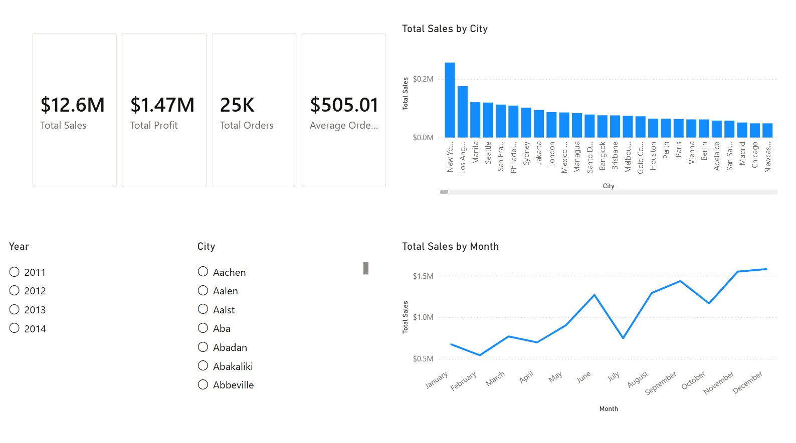
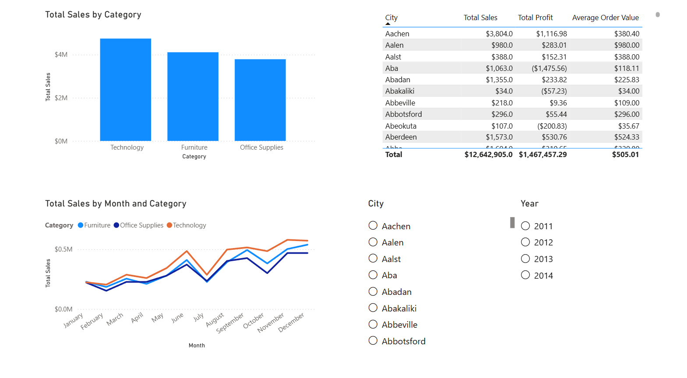
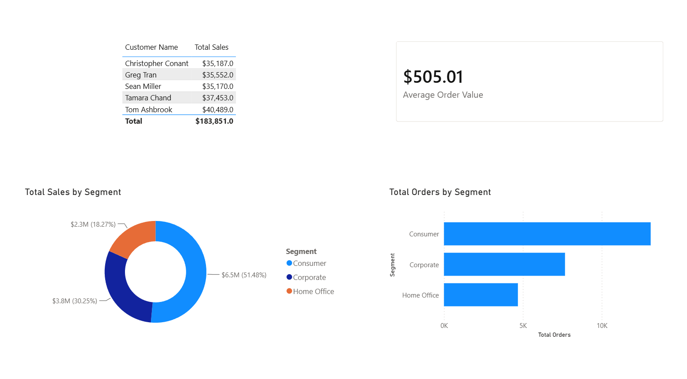
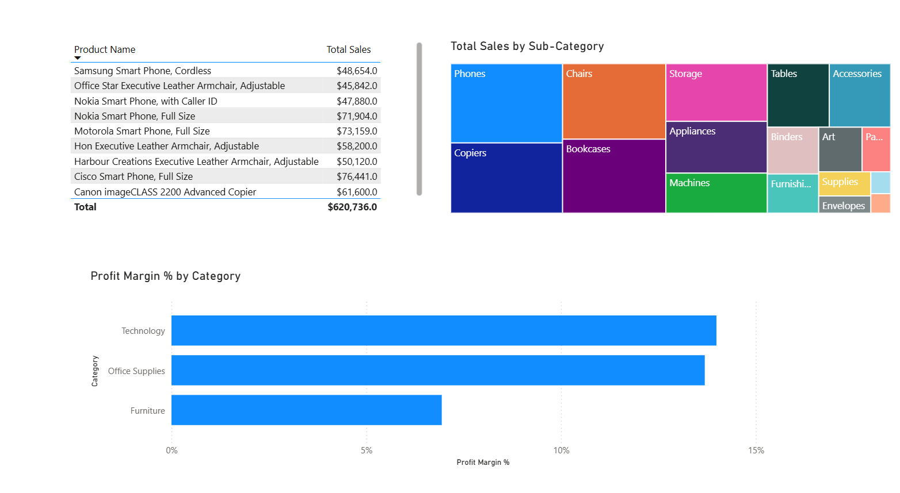

# AI Business Intelligence Internship

## Project Overview

This project was completed as part of the AI Business Intelligence Internship at TNM Software Solutions Pvt. Ltd. The project uses the Global Superstore dataset to analyze sales, profit, orders, customers, products, regions, and time-based performance. A four-page Power BI dashboard was created to present the main findings in a simple and useful way for business decision-making.

## Objectives

- Understand overall sales and profit performance.
- Identify strong customer segments and product categories.
- Analyze sales performance across regions and time.
- Identify areas where profitability can be improved.
- Present the findings through an interactive Power BI dashboard.

## Dataset

The project uses the Global Superstore dataset from Kaggle.

The dataset contains information about orders, customers, products, regions, sales, profit, and dates. The data was cleaned and checked before being used for analysis.

## Folder Structure

| Folder | Contents |
|---|---|
| 01_Raw_Data | Original dataset |
| 02_Cleaned_Data | Cleaned dataset and related files |
| 03_PowerBI | Power BI project file |
| 04_Documentation | Project documentation, DAX measures, insights and reports |
| 05_Screenshots | Dashboard screenshots |
| 06_Presentation | Final executive presentation |

## Tools Used

| Tool | Purpose |
|---|---|
| Power BI | Data modeling, DAX measures and dashboard creation |
| Power Query | Data cleaning and preparation |
| GitHub | Version control and project documentation |
| ChatGPT | AI-assisted analysis, dashboard planning and review |
| Kaggle | Dataset source |

## Weekly Progress

### Week 1
- Set up the project environment and GitHub repository.
- Selected and downloaded the Global Superstore dataset.
- Explored and cleaned the dataset.
- Documented data quality findings.

### Week 2
- Created the data model and star-style relationships.
- Created the Date table and core DAX measures.
- Built the four Power BI dashboard pages.

### Week 3
- Reviewed the dashboard using AI feedback.
- Applied improvements to the dashboard.
- Generated and verified five business insights.
- Created the final business report and executive presentation.

## Dashboard Screenshots

### Executive Summary

### Sales Analysis

### Customer Insights

### Product Performance

## Business Insights

### 1. Strong Overall Performance

The company generated around $12.64M in sales and $1.47M in profit, showing good overall performance. The focus should be on keeping sales growing while maintaining good profit.

### 2. Consumer Segment Leads Sales

The Consumer segment generated around $6.5M, or 51.48% of total sales, making it the biggest contributor. The company should focus on retaining these customers and encouraging repeat purchases.

### 3. Technology Is a Strong Category

Technology has the highest sales and around a 14% profit margin, making it one of the strongest categories. The company should continue supporting this category.

### 4. Furniture Has Lower Profitability

Furniture has a profit margin of around 7%, which is lower than Technology and Office Supplies. The company should review pricing and costs to find ways to improve profitability.

### 5. Sales Change During the Year

Sales change throughout the year, with November and December being stronger months and February being one of the weaker months. The company could prepare marketing and inventory plans around these seasonal patterns.

## AI Prompts Used

AI was used during the project for:

- Understanding the dataset.
- Planning the four-page Power BI dashboard.
- Reviewing dashboard screenshots.
- Generating and refining business insights.
- Drafting the business report.
- Creating the executive presentation outline.

The detailed prompts and AI responses are documented in 04_Documentation/ai_prompts_log.md.

## Lessons Learned

This project helped me understand how a BI project goes from raw data to a final business presentation. I learned about data cleaning, data modeling, DAX measures, Power BI dashboard design, and turning numbers into business insights. I also learned that AI can help with analysis and review, but its suggestions still need to be checked against the actual data.

## Future Improvements

- Add more recent data for future analysis.
- Include marketing and customer feedback data.
- Add more detailed regional analysis.
- Add forecasting to understand possible future sales trends.
- Continue improving the dashboard based on stakeholder feedback.
